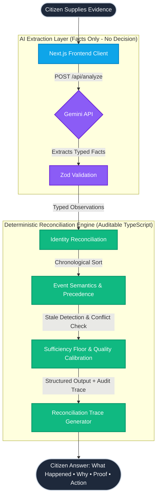

<div align="center">
  
  # 🏛️ ClaimClarity
  **Many signals. One evidence-backed answer.**

  <p align="center">
    ClaimClarity is a focused civic-tech prototype for reconciling fragmented, synthetic EPFO claim evidence. It is not a portal, tracker, calculator, or chatbot. It provides evidence-backed reconciliation for citizens facing contradictory records.
  </p>

  <br />

  [](https://nextjs.org/)
  [](https://www.typescriptlang.org/)
  [](https://deepmind.google/technologies/gemini/)
  [](https://tailwindcss.com/)

</div>

<hr />

## 🚨 The Problem
After submitting an EPFO claim, a citizen often encounters different and conflicting signals across multiple channels:
* The unified member portal
* The legacy tracker portal
* SMS notifications
* Digital passbook records
* Bank account credits

When one record says "Under Process", another says "Settled", and an SMS says "Pending", citizens don't know what to trust or whether to file a duplicate claim.

**ClaimClarity** resolves this ambiguity through **Evidence Reconciliation**:
1. AI (Gemini) extracts explicit facts into a strictly typed evidence model without deciding the final state.
2. A pure TypeScript deterministic engine reconciles identity, chronology, semantics, terminal outcomes, stale observations, and contradictions.
3. The UI presents the answer first (**ANSWER &rarr; WHY &rarr; PROOF &rarr; ACTION**) with an auditable deterministic trace.

> **Safety Policy:** ClaimClarity is designed to avoid unsupported conclusions by separating AI evidence extraction from deterministic reconciliation and explicitly surfacing uncertainty. All evaluations are framed strictly as *"Based on the evidence provided"*. It does not access live government servers or claim official verification.

---

## 🚀 Core Journey

The application provides a seamless, unauthenticated experience designed for rapid verification:

1. **Open the landing page** 
2. Click **Try sample scenarios** 
3. Review the provided synthetic artifacts (tracker status, SMS notices, bank/passbook entries)
4. Click **Analyze this claim** 
5. See the citizen-facing result:
   - **What happened?** (Current reconciled claim state)
   - **Why?** (Winning state rationale & why records look confusing)
   - **Proof** (Evidence Ledger with dates, channels, amounts, and stale observation tags)
   - **What should I do?** (One safe next action)
   - **Don't do this yet** (Actionable warning against unsafe duplicate filings)
   - **Reconciliation Trace** (Expandable deterministic audit trace showing competing states evaluated)
6. Click **Reset demo** to try another scenario.

### Built-in Scenarios:
* 🟢 **Scenario A (Records Disagree):** Portals show "Under Process", but a newer passbook record shows credit &rarr; **CREDITED** (earlier processing records flagged as superseded).
* 🟢 **Scenario B (Paid vs Processing):** Full chronological progression (Submitted &rarr; Processing &rarr; Settled &rarr; Credited) &rarr; **CREDITED**.
* 🟡 **Scenario C (Vague Signal):** Vague undated SMS without claim ID &rarr; **Honest UNKNOWN refusal** with missing information checklist.
* 🔴 **Scenario Conflict (Adversarial):** Rejection notice + Bank credit record &rarr; **CONFLICT DETECTED** (refusal to force a state; clearly surfaces what is known vs unconfirmed).

---

## 🏗️ System Architecture

The core architecture separates extraction from decision-making: **AI extracts facts; deterministic rules reconcile them.**



---

## 🛠️ Tech Stack & Implementation Details

### Frontend
- **Framework:** Next.js 14 (App Router)
- **Styling:** Vanilla CSS design tokens + responsive layouts
- **Accessibility:** Accessible semantic HTML, high-contrast badges, mobile-responsive layout readable in under 5 seconds

### Backend & AI
- **LLM:** Google Gemini API (via `@google/genai`) for structured factual extraction only
- **Validation:** Zod (Strict schema enforcement on artifacts, events, conflicts, and traces)
- **Deterministic Reconciler:** Pure TypeScript rule engine (`lib/reconciliation/reconcileClaim.ts`)

### Resilience & Demo Mode
If the Gemini API key is not configured, the system seamlessly operates in **Demo Mode**, routing pre-structured synthetic records directly into the deterministic reconciliation engine.

---

## 🏃‍♂️ Running Locally

1. **Clone the repository**
```bash
git clone https://github.com/Tanish9022/ClaimClarity.git
cd ClaimClarity
```

2. **Install dependencies**
```bash
npm install
```

3. **Run Unit Tests**
```bash
npm test
```

4. **Run End-to-End Tests**
```bash
npx playwright test
```

5. **Start Development Server**
```bash
npm run dev
```
Open [http://localhost:3000](http://localhost:3000) to view the application.

---

<div align="center">
  <i>Independent prototype using synthetic data. Not an official EPFO service.</i>
</div>